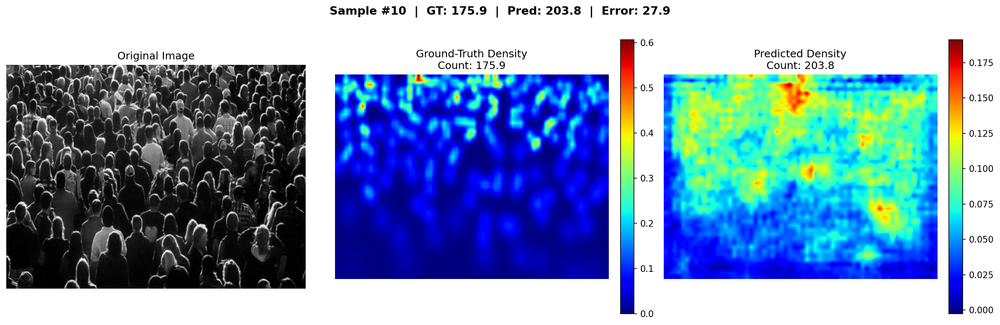

# Crowd Density Estimation

A deep learning project that estimates the number of people in crowd images using a CSRNet-style CNN regression model.

---

## Results

| Metric | Value |
|--------|-------|
| MAE | 108.13 |
| MSE | 26,611.41 |
| RMSE | 163.13 |

Trained for 30 epochs on Google Colab (NVIDIA T4 GPU).

---

## Sample Output


 
---

## Project Structure

```
crowd-density-estimation/
├── crowd_density_estimation_v2.py   # Main training and evaluation code
├── demo.py                          # Run prediction on a random test image
├── outputs/
│   ├── training_loss.png            # Loss curve
│   ├── prediction_0.png             # Sample predictions
│   ├── prediction_5.png
│   └── prediction_10.png
└── README.md
```

---

## Model Architecture

- **Frontend** — VGG-16 first 10 layers pretrained on ImageNet, 3 MaxPool layers (stride 8)
- **Backend** — 4 dilated convolutional layers (dilation=2) for enlarged receptive field
- **Loss** — Mean Squared Error (MSE)
- **Optimizer** — Adam (LR = 1e-5)
- **Output** — Density map at 1/8 resolution, sum = estimated crowd count

---

## Dataset

ShanghaiTech Part-A Crowd Dataset

| Split | Images | Total Annotations |
|-------|--------|------------------|
| Train | 300 | ~182,000 heads |
| Test | 182 | ~59,000 heads |

Download from Kaggle:
```
https://www.kaggle.com/datasets/tthien/shanghaitech-with-people-density-map
```

---

## Setup

**1. Clone the repository**
```bash
git clone https://github.com/Harshit-925/crowd-density-estimation.git
cd crowd-density-estimation
```

**2. Install dependencies**
```bash
pip install torch torchvision opencv-python h5py numpy matplotlib Pillow
```

**3. Download the dataset from Kaggle and place it as:**
```
crowd-density-estimation/
    ShanghaiTech/
        part_A/
            train_data/
                images/
                ground-truth-h5/
            test_data/
                images/
                ground-truth-h5/
```

**4. Update the path in the code**
```python
BASE_DIR = r"path\to\ShanghaiTech\part_A"
```

---

## Training

Training on CPU is very slow. Google Colab with a free T4 GPU is recommended.

```bash
python crowd_density_estimation_v2.py
```

Training time on T4 GPU — approximately 15 minutes for 30 epochs.

---

## Demo

Run prediction on a random test image:
```bash
python demo.py
```

Output is saved as `demo_result_YYYYMMDD_HHMMSS.png` in the project folder.

---

## Comparison

| Model | Epochs | MAE | RMSE |
|-------|--------|-----|------|
| This project (CPU, 5 epochs) | 5 | 150.06 | 205.46 |
| This project (GPU, 30 epochs) | 30 | **108.13** | 160.10 |
| CSRNet (fully trained) | ~400 | ~68 | ~115 |

---

## Technologies Used

- Python 3.x
- PyTorch
- torchvision (VGG-16)
- OpenCV
- NumPy
- Matplotlib
- h5py
- Google Colab (T4 GPU)

---

## Department

Computer Science & Engineering — Third Year Mini Project
